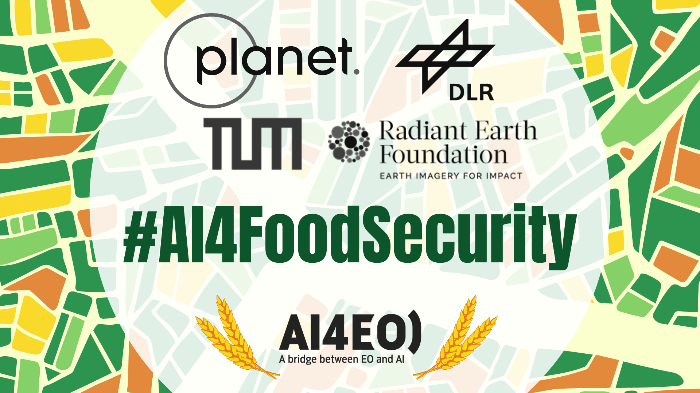

# AI4FoodSecurity - A Challenge for Crop Type Classification

## Get started with the challenge

This [notebook](notebook/starter-pack.ipynb) will get you started with downloading, exploring and analysing the input and output data of the challenge.

The proposed challenge will focus on crop type classification based on a time-series input of _Sentinel-1_, _Sentinel-2_ and _Planet Fusion_ data. The challenge will cover two areas of interest, in Germany and South Africa, with high-quality cadastral data on field boundaries and crop types as ground truth input. 

The challenge will consist of two tracks:
  * Within-season crop identification, over the South Africa AOI
  * Reusability of models for crop identification from one growing season to the next, over the Germany AOI

The participants will not be required to participate in both challenges. However, the evaluation mechanism behind both tracks are the same, as well as the rules and prize catalogue.

This notebook showcases how to download and process the data, but you are free to use any open souce Python library specifically designed to deal with Earth Observation data such as [eo-learn](https://eo-learn.readthedocs.io/en/latest/index.html). In this notebook, the data is stored as `tif` images, `numpy` arrays and `geopandas` dataframes to facilitate processing operations and `torch` is preferred for data processing and training. However, you can use any other Python tool of preference to process the provided data.

The notebook also showcases how to generate a valid submission file.

As per challenge rules, the following applies:
 * no data source other than the ones provided can be used to produce your outputs;
 * pre-trained models are allowed;

Code for the winning solutions will be reviewed to ensure rules have been followed.

The challenge is organized by [Planet](https://www.planet.com/), [Radiant Earth](https://www.radiant.earth/), [TUM](https://www.tum.de/), [DLR](https://www.dlr.de/DE/Home/home_node.html), and the [Helmholtz AI](https://www.helmholtz.ai/), and hosted by [European Space Agency](https://www.esa.int/).

    
    
    
    
    
    
    

